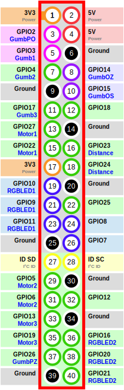

# Preconditions

Max motor speed: \\(0.5 \ \frac{m}{s}\\)

Radius between wheels: \\(0.2 \ m\\)

Max measured distance for Distance Sensor: \\(1 \ m\\)

# Motor operations calculation

For the motor we can only set the power of and direction of rotation for the motor.
In our preconditions we have max rotation seed .

## Movement

\\( \mathit{time} = \frac{\mathit{distance}}{\mathit{speed}} \Rightarrow t = \frac{d}{s}\\)

## Rotation

\\( \mathit{distance} = \frac{2 \pi \cdot \mathit{radius} \cdot \mathit{degrees}}{360} \Rightarrow d = \frac{2\pi \cdot r \cdot x}{360} = \frac{o \cdot x}{360}\\)

# Pins layout

	

# GPIO Zero documentation

[Base documentation](https://gpiozero.readthedocs.io/en/stable/index.html)

* Input:
	- [Button](https://gpiozero.readthedocs.io/en/stable/api_input.html#button)
	- [DistanceSensor](https://gpiozero.readthedocs.io/en/stable/api_input.html#distancesensor-hc-sr04)
* Output:
	- [RGBLED](https://gpiozero.readthedocs.io/en/stable/api_output.html#rgbled)
	- [Motor](https://gpiozero.readthedocs.io/en/stable/api_output.html#motor)
	- [Robot](https://gpiozero.readthedocs.io/en/stable/api_boards.html#robot)

# Flask

[Base documentation](https://flask.palletsprojects.com/en/1.1.x/api/)

* [Response](https://flask.palletsprojects.com/en/1.1.x/api/#flask.Response)
* [jsonify](https://flask.palletsprojects.com/en/1.1.x/api/#flask.json.jsonify)
* [abort](https://flask.palletsprojects.com/en/1.1.x/api/#flask.abort)

# SoundFile

[Base documentation](https://pysoundfile.readthedocs.io/en/latest/)

* [read](https://pysoundfile.readthedocs.io/en/latest/#soundfile.read)

# PyAudio

[Base documentation](http://people.csail.mit.edu/hubert/pyaudio/docs/)

* [Stream](http://people.csail.mit.edu/hubert/pyaudio/docs/#class-stream)
	- [Play audio](http://people.csail.mit.edu/hubert/pyaudio/docs/#pyaudio.Stream.write)
	- [Play audio example](http://people.csail.mit.edu/hubert/pyaudio/docs/#example-blocking-mode-audio-i-o)
	- [Record audio](http://people.csail.mit.edu/hubert/pyaudio/docs/#pyaudio.Stream.read)
	- [Record audio example](https://gist.github.com/mabdrabo/8678538)

* Detection of frequencies
	- [Quadratic Interpolation Spectral Peaks](https://ccrma.stanford.edu/~jos/sasp/Quadratic_Interpolation_Spectral_Peaks.html)

# NumPy

* [FFT](https://numpy.org/doc/stable/reference/generated/numpy.fft.fft.html)
* [Hamming window](https://numpy.org/doc/stable/reference/generated/numpy.hamming.html)

# Python documentation

* [multiprocessing](https://docs.python.org/3/library/multiprocessing.html)
	- [synchronization](https://docs.python.org/3/library/multiprocessing.html#synchronization-between-processes)
	- [exchanging data between processes](https://docs.python.org/3/library/multiprocessing.html#exchanging-objects-between-processes)
* [time](https://docs.python.org/3/library/time.html)
	- [sleep](https://docs.python.org/3/library/time.html#time.sleep)
	- [time](https://docs.python.org/3/library/time.html#time.time)
* [datetime](https://docs.python.org/3/library/datetime.html)
	- [date](https://docs.python.org/3/library/datetime.html#date-objects)
	- [today](https://docs.python.org/3/library/datetime.html#datetime.date.today)
	- [strftime](https://docs.python.org/3/library/datetime.html#datetime.date.strftime)
		+ [format definition](https://docs.python.org/3/library/datetime.html#strftime-and-strptime-behavior)
* [string replace](https://docs.python.org/3/library/stdtypes.html#str.replace)
* [files](https://docs.python.org/3/tutorial/inputoutput.html#reading-and-writing-files)